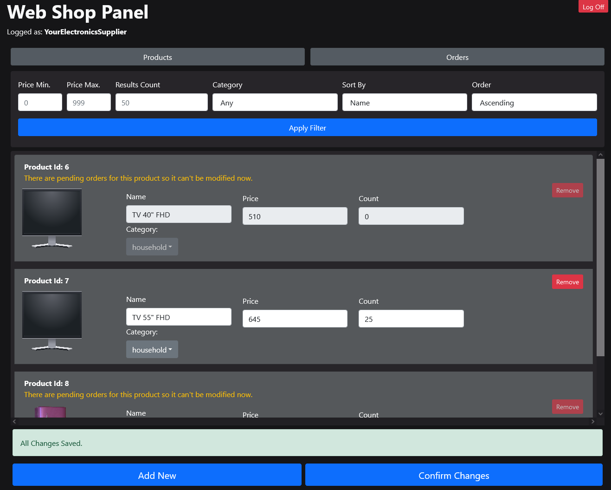
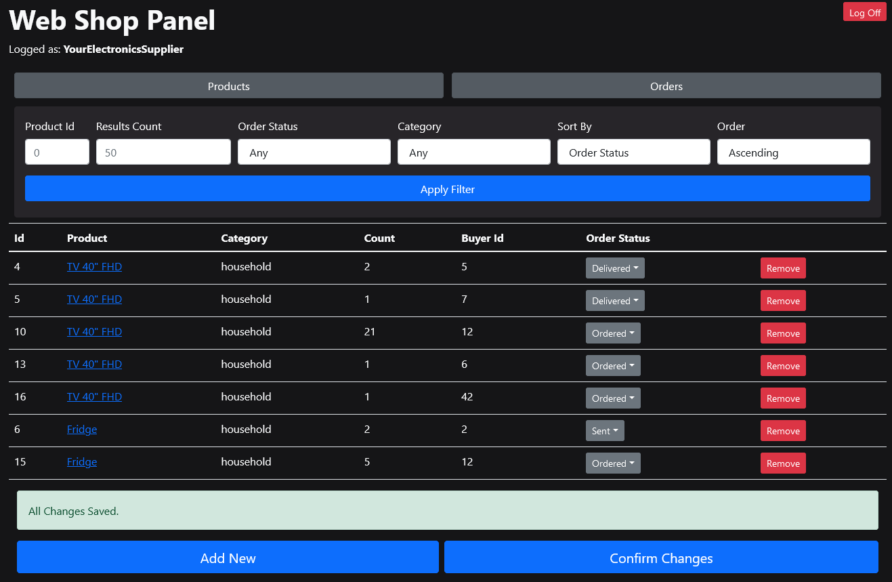

# Small Shop REST API Client
[React.js](https://reactjs.org/) web app made as a frontend for my small [REST API](https://github.com/t-cel/Small-Shop-REST-API).

It basically allows to do most things that API allows through a simple user interface.

# Installation
First: get [Shop api](https://github.com/t-cel/Small-Shop-REST-API) running.

In project directory:

    npm install
   
   After installing dependencies:

    npm start
This should start new browser tab at http://localhost:3000

# Third party:
- [react-idle-timer](https://github.com/SupremeTechnopriest/react-idle-timer) for logging off inactive user
- [react-router](https://github.com/ReactTraining/react-router) for routing
- [eventing-bus](https://github.com/arkency/event-bus) for simple event delegation across components